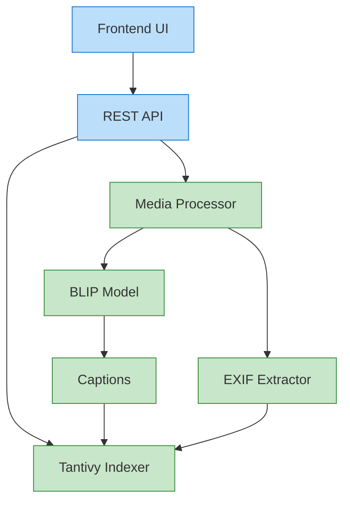

# System Architecture Overview

## High-Level Architecture

ViZearch is built using a modular architecture that separates concerns and allows for scalability and maintainability. The system consists of four main components:

## Core Components

### 1. Frontend
A React-based user interface that provides:

- Search interface with query input
- Results display with media previews
- Filtering options
- Result management

### 2. API Layer
There two API options:
(See Locust Load Testing)

- Fast API based
- BentoML based

### 3. Media Processing Pipeline
Responsible for:

- Ingesting media files (images and videos)
- Extracting frames from videos
- Preprocessing images for the BLIP model
- Extracting EXIF data

### 4. Semantic Understanding Engine
Built around the BLIP model:

- Processes images to understand visual content
- Generates textual descriptions of visual content

### 5. Tantivy Indexer
Based on Tantivy:

- Maintains indices for fast retrieval
- Performs hybrid search combining semantic and metadata filtering
- Ranks results by relevance

