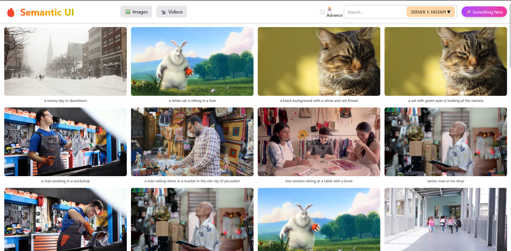

# ViZearch - Semantic Search Platform

Welcome to the official documentation for ViZearch, an advanced semantic search platform for image and video content.

## Overview

ViZearch is a powerful platform that combines computer vision models with efficient search technologies to enable search across media collections. Our system processes images and videos, extracts semantic information, and makes it searchable using plain English queries.

## Getting Started

- Check the [Installation Guide](setup.md) to set up ViZearch
- Explore the [Architecture Overview](architecture.md) to understand the system

## Key Features

- Natural language search for images and videos
- Temporal and EXIF-based filtering capabilities
- High-performance search indexing with Tantivy
- Modern, intuitive user interface
- Fast API and Bentoml as service providers

## Technical Stack

- BLIP model for image understanding
- Tantivy search engine for high-performance indexing
- React frontend for seamless user experience

