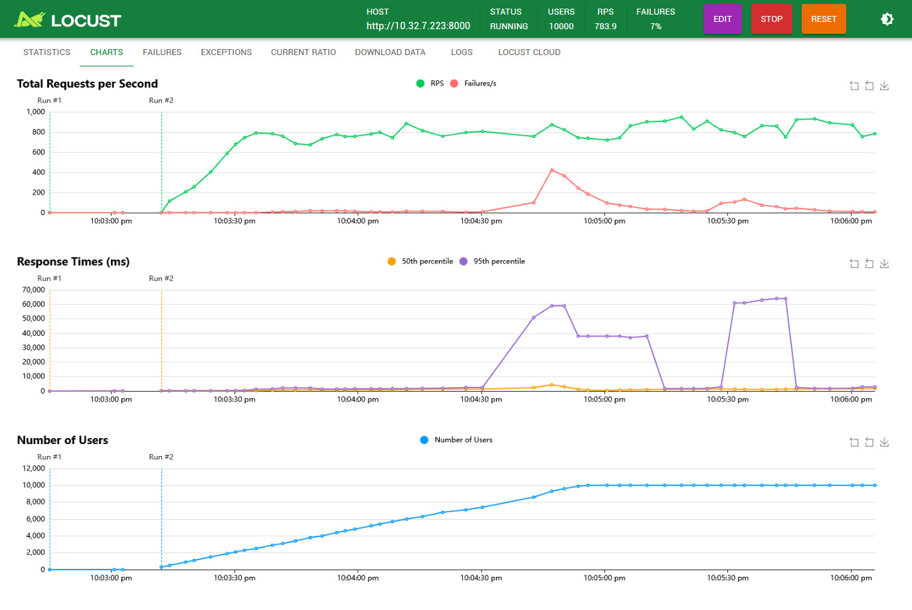
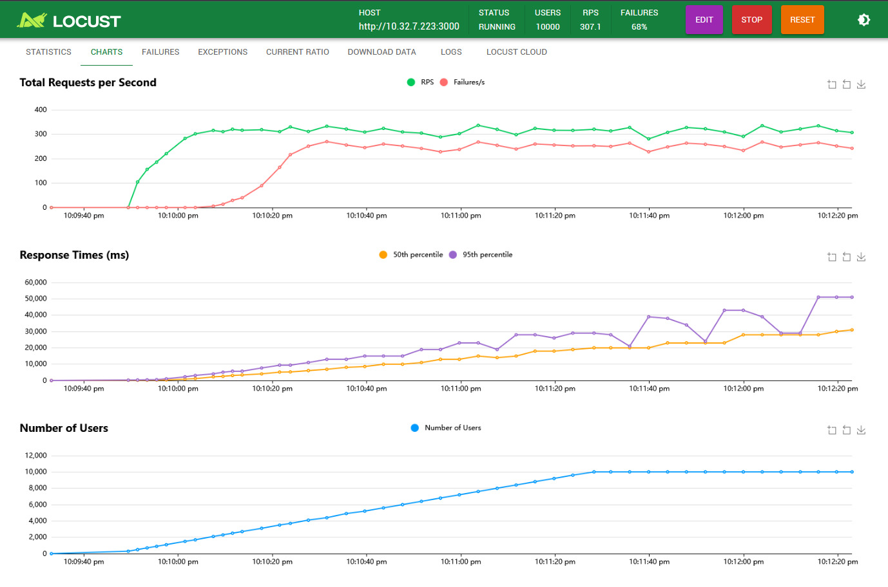

# Locust Load Testing

## Overview
[Locust](https://locust.io/) is an open-source load testing tool that allows you to define user behavior with Python code and swarm your system with millions of simultaneous users to test its performance.

## Test Setup

We performed load testing on both our FastAPI and BentoML implementations to compare their performance characteristics under different load conditions.

## FastAPI Test Results

The FastAPI implementation was tested with various concurrent users and request rates to evaluate its performance under load.

The Hardware where the load was tested:

- 2 core cpu
- 4 GB ram

### Key Metrics:
- Response time
- Requests per second
- Failure rate
- Number of users

## BentoML Test Results

Similarly, we evaluated the BentoML implementation with the same test parameters to ensure a fair comparison.

### Key Metrics:
- Response time
- Requests per second
- Failure rate
- Number of users

## Performance Comparison

This section compares the performance characteristics of both implementations:

## Conclusion

Based on our load testing with Locust, we can draw the following conclusions about the performance of FastAPI versus BentoML for our semantic search application:

FastAPI showed better results than BentoML in ***this case*** 